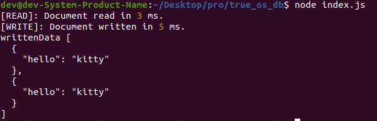
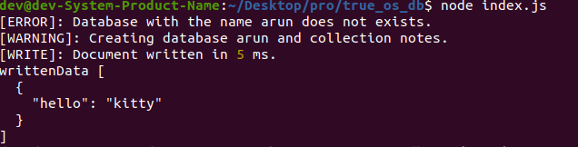

# True Open Source DB

**JSON database written in node.js.**

It works in a no-sql manner. `Databases` are folders, `collections` are json files and `documents` are individual objects inside these json files.

### Specifying `dbOptions`

```javascript
const dbOptions = {
  database: "arun",
  collection: "notes",
};
```

`database` is the current database on which operations will be operated. `collection` is the active file.

### Making a `notes` document

```javascript
// Making a new document
const notes = new TODB(dbOptions);
// Writing to the document
// If it is not empty then append at the end
const writtenData = await notes.write({ hello: "kitty" });
// Write function returns the data of the document
console.log("writtenData", writtenData);
```

This outputs



> **Note:** `write()` function makes the collection as well as database if it is not present.


